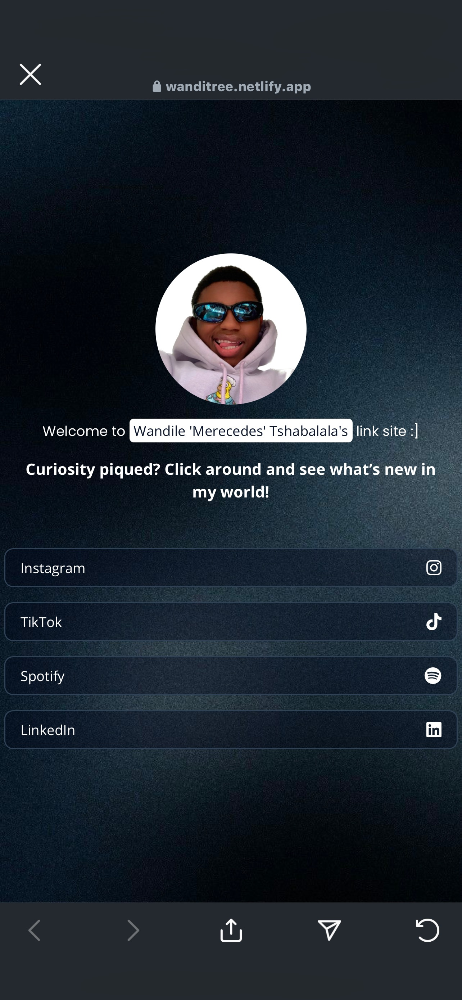

## Welcome to Linktree.Mercedes

**Linktree.Mercedes** is my personal link site, designed to provide easy access to social media profiles and platforms. Explore and connect with my Instagram, TikTok, Spotify, and LinkedIn through a minimalistic and responsive interface.

---

## Project Overview

This project enables users to easily access important social media accounts through a clean and responsive design. The page is styled using **CSS** and incorporates **FontAwesome** icons for a visually engaging user experience. It also includes:

- A full-screen background image
- A personal profile picture
- A welcoming message to make the site more personable and engaging

---

## Technologies Used

- **HTML5**: Provides the structure of the webpage, ensuring accessibility and semantic markup.
- **CSS3**: Used for custom styling and responsive design, ensuring the page looks great across all devices.
- **FontAwesome**: Integrated to display icons for various social media platforms.
- **Google Fonts**: Utilizes *Open Sans* and *Poppins* fonts for modern typography.
- **Responsive Web Design**: The layout adjusts seamlessly from mobile to desktop views for an optimized user experience.

## It is also responsive:

